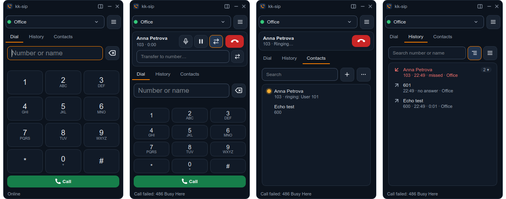
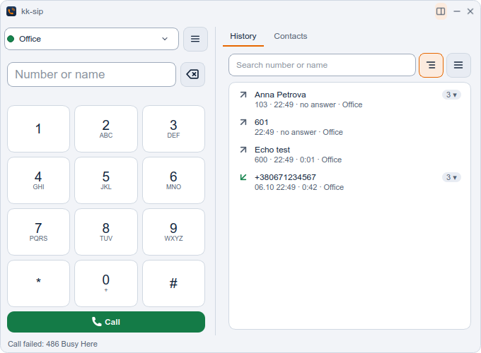
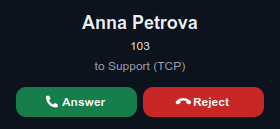
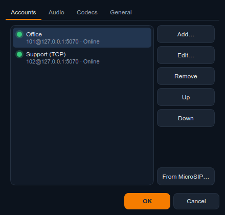

<p align="center">
  
</p>

# kk-sip

[](https://github.com/kochevrin/kk-sip/actions/workflows/build.yml)
[](LICENSE)

A minimal SIP softphone for Linux and Windows in the spirit of [MicroSIP](https://www.microsip.org):
a small window, simple settings, many accounts, call history and a phone book.
Nothing else. Built on [PJSIP](https://www.pjsip.org) (the SIP stack MicroSIP
uses) and Qt 6.

<p align="center">
  
</p>

## Features

- **Small fixed-size window** that lives in the system tray: compact 300×500 px, or
  a wide 680×500 px view with history and contacts next to the dial pad (button in
  the title bar or ☰ menu → Wide view). It never stretches across the screen
- **Many accounts registered at the same time.** All of them receive calls; a
  drop-down at the top picks the one for outgoing calls, with a status dot for each
- **Call history** with incoming, outgoing, missed and declined calls. Double-click
  to call back. Missed calls show a badge and a tray notification. Search by number
  or name, and two views: grouped by number (one row per number with a call count,
  click it to see every call with that number) or all calls in one list
- **Phone book** with search, a contact hint under the dial field, and CSV import/export
- **Busy lamps (BLF)** for colleagues: green free, blinking orange ringing (with who is
  calling and a one-click pickup, `**ext`), red on a call. Uses dialog-event
  subscriptions, which Asterisk and FreePBX support out of the box
- **Easy migration from MicroSIP**: import `Contacts.xml` and the accounts from
  `microsip.ini`
- **Calls**: answer/reject popup, hold, mute, blind transfer, DTMF from the keypad,
  several calls at once (others go on hold automatically)
- UDP / TCP / TLS, optional SRTP, outbound proxy, separate auth ID and domain
- Codecs: Opus, G.722, G.711 (PCMA/PCMU), GSM, Speex, iLBC; order and on/off
  are set in Settings
- Do-not-disturb mode, custom WAV ringtone
- Starts with the system straight into the tray (optional)
- Light and dark theme in the kk family style, built from the logo's navy and orange,
  with WCAG AA contrast for text; follows the system or set by hand
  (quick switch in the ☰ menu);
  slim own title bar with a 1px edge instead of the window manager frame (optional)
- Opens `sip:`, `tel:` and `callto:` links (`kk-sip tel:+380...`); a second launch
  hands the number to the running instance
- English, Ukrainian and Russian UI: follows the system or set in Settings → General

<p align="center">
  
</p>

<p align="center">
  
  &nbsp;
  
</p>

## Install

Packages are attached to every [release](https://github.com/kochevrin/kk-sip/releases):

| System | File | Install |
|---|---|---|
| Arch, EndeavourOS, Manjaro | `kk-sip-<ver>-1-x86_64.pkg.tar.zst` | `sudo pacman -U kk-sip-*.pkg.tar.zst` |
| Ubuntu 24.04+, Debian 13+ | `kk-sip_<ver>_amd64.deb` | `sudo apt install ./kk-sip_*_amd64.deb` |
| Any other distribution | `kk-sip-<ver>-x86_64.AppImage` | `chmod +x kk-sip-*.AppImage` and run it |
| Windows 10/11 (x64) | `kk-sip-<ver>-windows-x64.msi` | double-click, or `msiexec /i kk-sip-<ver>-windows-x64.msi /qn` |
| Windows, no install | `kk-sip-<ver>-windows-x64.zip` | unpack anywhere and run `kk-sip.exe` |

The MSI installs for all users into `Program Files\kk-sip`, adds a Start menu
entry and registers kk-sip for `sip:`, `tel:` and `callto:` links. It installs
silently, so it can be assigned through Group Policy or pushed with SCCM, Intune or
Ansible (`win_package`). A newer MSI replaces the older one in place.

After installing, kk-sip shows up in the application menu. To start it with the
system, use ☰ → Settings → General → *Start with the system*.

Moving from MicroSIP? Copy `microsip.ini` and `Contacts.xml` from the Windows
machine (`%APPDATA%\MicroSIP`, or the MicroSIP folder for the portable version), then run

```sh
kk-sip --import-microsip /path/to/that/folder
```

MicroSIP encrypts passwords with a Windows key, so accounts arrive switched off.
Pick one and press *Call*, and kk-sip asks for its password.

## Build

Arch / EndeavourOS:

```sh
sudo pacman -S --needed base-devel cmake qt6-base qt6-svg qt6-tools opus openssl alsa-lib
git clone https://github.com/kochevrin/kk-sip.git && cd kk-sip
scripts/build-pjsip.sh            # static PJSIP 2.17 into .deps/ (~2 min, once)
cmake -S . -B build
cmake --build build -j"$(nproc)"
./build/kk-sip
```

Windows: in an [MSYS2](https://www.msys2.org) UCRT64 shell,
`packaging/windows/build-windows.sh --install-deps` builds everything and stages
the app with its DLLs in `dist\stage` plus a portable ZIP; then
`packaging\windows\build-msi.ps1` (PowerShell, needs the .NET SDK for WiX) makes the MSI.

Debian / Ubuntu: `packaging/linux/build-ubuntu.sh --install-deps` installs the
dependencies and produces the `.deb` and the AppImage in `dist/`.

Arch package of the latest tagged release: `cd packaging/arch && makepkg -si`.

If you would rather use a system PJSIP (for example the AUR `pjproject`
package), skip `build-pjsip.sh`. CMake picks up `libpjproject` through
pkg-config.

Install system-wide (binary, `.desktop` file with the `sip:`/`tel:` handlers, icon):

```sh
sudo cmake --install build
```

## Where data lives

| What | Linux | Windows |
|---|---|---|
| Autostart (when enabled) | `~/.config/autostart/kk-sip.desktop` | `HKCU\…\CurrentVersion\Run\kk-sip` |
| Settings and accounts | `~/.config/kk-sip/kk-sip.ini` | `%LOCALAPPDATA%\kk-sip\kk-sip.ini` |
| History and contacts (SQLite) | `~/.local/share/kk-sip/kk-sip.db` | `%LOCALAPPDATA%\kk-sip\kk-sip.db` |
| SIP debug log (when enabled) | `~/.local/share/kk-sip/pjsip.log` | `%LOCALAPPDATA%\kk-sip\pjsip.log` |

Passwords are stored in plain text in the settings file (mode 600 on Linux).

## Audio

On Windows kk-sip uses the standard Windows audio devices; "System default"
follows the default device in Sound settings.

On Linux kk-sip talks to ALSA. On a PipeWire or PulseAudio desktop, "System default" uses
the sound server's ALSA plugin, so calls follow the default device. You can move
the kk-sip stream to a headset in the KDE/GNOME volume applet, and it will be
remembered.

## Architecture

```
Qt Widgets UI (src/ui)                     SipEngine (src/sip)
 MainWindow ─ account switcher, tray       Qt facade over PJSUA2
  ├─ CallPanel   (active calls)      ◄──►   ├─ KkAccount : pj::Account (one per account)
  ├─ DialerTab / HistoryTab / ContactsTab   ├─ KkCall    : pj::Call
  └─ IncomingDialog, SettingsDialog         └─ ring / ringback tones
              │                                     │ polled from a QTimer on the GUI thread
 core (src/core): Settings (INI), Database          │ (threadCnt = 0, mainThreadOnly)
 (SQLite), SipUri, SingleInstance, MicroSIP import  ▼
                                            PJSIP 2.17 (static) → ALSA → PipeWire
```

All PJSIP callbacks run on the GUI thread, so there is no locking between the SIP
stack and the UI.

PJSIP is built with the fixes in [`patches/`](patches/) until they land upstream
(currently: a crash on dialog-event NOTIFYs without `<remote>`, which Asterisk sends
when a watched extension hangs up).

## Tests

`scripts/smoke-test.sh` runs an end-to-end test against Asterisk in Docker:
registration, outgoing, busy, incoming, missed calls, hold, mute and DTMF.
See [tests/README.md](tests/README.md). On Windows CI the same test runs with
`KKSIP_TEST_SERVER=offline`, which skips the parts that need a PBX.

## License

GPL-2.0-or-later, see [LICENSE](LICENSE). Third-party components are listed in
[THIRD-PARTY.md](THIRD-PARTY.md).

---

**Українською.** kk-sip — мінімалістичний SIP-телефон для Linux і Windows на зразок
MicroSIP: маленьке вікно, багато облікових записів одночасно зі швидким перемиканням,
історія з пошуком і зворотним дзвінком, телефонна книга. Мова інтерфейсу (українська,
російська, англійська) береться з системи або обирається в «Налаштування → Загальні».

**По-русски.** kk-sip — минималистичный SIP-телефон для Linux и Windows по образцу MicroSIP:
маленькое окно, несколько аккаунтов одновременно с быстрым переключением,
история с поиском и обратным звонком, телефонная книга. Язык интерфейса (украинский,
русский, английский) берётся из системы или выбирается в «Настройки → Общие». Контакты и аккаунты можно перенести из MicroSIP:
«Контакты → … → Импорт» и «Настройки → Аккаунты → Из MicroSIP…».
